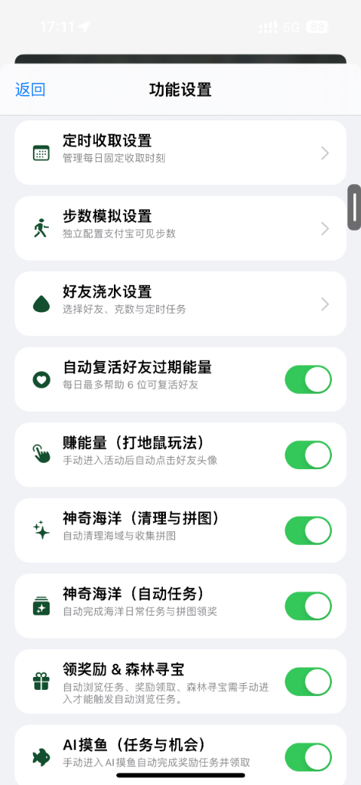

# AntForest TrollFools Port

基于iOS巨魔插件的支付宝蚂蚁森林能量自动收取插件，支持巨魔商店 TrollStore + 巨魔注入器 TrollFools 。它不依赖 MobileSubstrate、Theos 或 CaptainHook，使用 Objective-C Runtime Hook 构建为 `arm64 + arm64e` 通用 dylib。

## 来源与致谢

本项目基于 [qsirwyk/AntForestOneCollect](https://github.com/qsirwyk/AntForestOneCollect) 二次开发，保留原项目的 MIT 许可证与版权声明。感谢原作者 qsirwyk 的开源贡献。

> 请自行评估账号、服务规则与设备安全风险。本项目不提供绕过风控或安全机制的功能。

## 效果图

| 收取记录面板（v3.1 正式版） | 功能设置面板 |
| :---: | :---: |
|  |  |

功能包括：

- 右侧悬浮叶子按钮：首页首次打开或从后台返回后完整显示；静置约 2 秒自动贴边缩小。左侧向右滑、右侧向左滑可展开，拖动位置会保存在本机。
- 收取记录面板：紧凑统计与四项收取控制；通过右上角“功能设置”管理定时收取、步数模拟、好友浇水和赚能量开关；支持“清空日志”与“复制日志”。
- 自动收取总开关：控制常规自动收取；关闭后好友/自己收取、后台循环与定时收取都会暂停。
- 收取自己能量：独立开关；开启后每轮优先查询并提交自己的成熟能量收取，再继续扫描好友能量。
- 自动能量雨：可独立开关；开启后进入能量雨并点击“立即开启”，插件会自动点击屏幕内正在下降的能量。
- 自动赚能量（打地鼠玩法）：在“功能设置”独立开关；手动进入并开启活动后，自动识别活动 Canvas 内出现的好友头像并点击；仅在活动专用页面生效，不影响森林首页收取。
- 循环收取（面板中显示为“后台循环”）：可独立开关；支持设置 1～60 分钟间隔，默认 5 分钟；当前以森林首页前台运行作为可靠使用条件。
- 定时收取：在“功能设置”独立开关；在设置的时间点触发整点秒级收取。
- 步数模拟：独立开关；自定义每日步数区间与随机步数，同步上传至支付宝运动。
- 好友浇水：支持手动、定时与打开蚂蚁森林自动浇水三种模式；可配置每位好友浇水克数（10g / 18g / 33g / 66g）与目标好友列表。
- 神奇海洋（自动任务）：独立开关；自动扫描海洋日常任务、拼图任务并一键完成与领奖。
- 领奖励 & 森林寻宝：独立开关；自动完成每日签到、安全浏览/逛一逛任务，并自动领取今日累计阶梯大奖；手动进入寻宝活动页面后自动执行大奖抽奖。
- AI摸鱼：独立开关；自动完成摸鱼日常任务与涂鸦机会领取。
- 芭芭农场：独立开关；自动完成日常浏览、部分游戏、连续签到任务与肥料批量领取。
- 蚂蚁庄园：独立开关；自动每日签到、小课堂智能满分答题、智能防重喂养、自动收取小鸡金色肥料，以及一键批量领取已完成的饲料奖励。
- 新版保护地（大富翁）：独立开关；手动进入保护地后自动巡护走步、科普满分答题、步数兑换、最优物种派遣与碎片合成。
- 首页动物在岗巡护能量：实时自动感知保护地动物在岗巡护产出的能量球并自动收取入账。
- 自动复活好友过期能量：独立开关；扫描好友排行榜时自动复活好友可复活的过期能量。
- 保护罩检测：精准识别好友是否处于能量保护罩中，自动跳过不可收好友。
- 收取日志：最新记录显示在顶部；保留开关状态、本轮扫描开始/结束、浇水赠能、好友浇水和成功收取结果，并区分自己与好友能量。
- 能量统计：今日显示 g；累计满 1,000 g 后按两位小数换算为 kg；收取成功回包会去重计入统计。

> v3.1 正式版：iOS 15 及以上请使用 [`AntForestPort-v3.1.dylib`](build/AntForestPort-v3.1.dylib)；iOS 14 请使用独立兼容包 [`AntForestPort-v3.1-iOS14.dylib`](build/AntForestPort-v3.1-iOS14.dylib)。包含蚂蚁庄园全自动化（签到/小课堂智能答题/智能喂养/防爆仓保护/收小鸡肥料/一键领饲料）、芭芭农场做任务集肥料、领奖励（签到绝对前置+主线安全任务+阶梯大奖）& 森林寻宝（自动做任务+连续自动抽奖）、神奇海洋专属日常任务与救助海洋动物、AI摸鱼、新版保护地（大富翁）全流程自动化，以及蚂蚁森林首页动物在岗巡护能量自动收取。产物均为 `arm64 + arm64e` 通用 dylib。

## v3.1 正式版更新说明

v3.1 正式版在 v3.0 的基础上进行了深度打磨与稳定性重构，重点修复了森林首页榜单交互、领奖励阶梯进度、蚂蚁庄园与芭芭农场等一系列核心问题，运行更加丝滑稳定：

- **🎁 领奖励与活力任务体系深度优化**：
  - **签到绝对前置**：每日零点领奖励任务刷新时，强制优先完成每日能量签到，确保今日累计任务进度重置激活后再跑常规任务，彻底解决“40g/60g/100g 阶梯累计奖励无法刷新与领取”的顽疾；
  - **抽屉防误跳**：彻底修复每日首次打开领奖励抽屉时误跳芭芭农场（“逛农场得落叶肥料”误触发）的问题；
  - **页面驻留自动领奖**：长留在森林首页也能自动稳定完成副玩法任务并准确派发阶段大奖；
  - **解封惊喜市集与寻宝**：修复集市与寻宝中的误拦截与重复循环判定。
- **🐔 蚂蚁庄园自动化全面重构与防爆仓保护**：
  - **真实底层 RPC 替换盲猜**：全面重构投喂（`alipay.antfarm.orchard.feedChicken`）、签到、打扫鸡屎等底层协议；
  - **防爆仓智能保护**：增加背包容量判定（1800g/2000g），满仓时智能暂缓领取任务饲料，待小鸡进食腾仓后自动补领，绝不浪费饲料；
  - **支持 `TRIGGER` 触发类任务**：打通饿了么农场、美团、头条极速版、蚂蚁新村等第三方唤醒类任务协议；
  - **独立 Bridge 隔离**：防止庄园与森林/农场桥接串扰导致自动收取中断。
- **🌾 芭芭农场做任务集肥料智能过滤**：
  - 精准识别农场可自动完成的浏览与签到任务；
  - 智能排除需要真实运行小游戏内部关卡（消消乐、合成等）或依赖真实 App 唤醒的不可做任务，杜绝无效重试与死循环。
- **🔇 日志去噪与极致轻量化**：
  - 彻底关闭测试阶段的全量抓包探针日志，消除大文件与性能损耗；
  - 精简收取提示，过滤服务网关常规繁忙提示（3000/999）与常规保活拉取噪音，日志干净清晰。

v3.0 是自 v2.8.3-1 以来最为重磅的全场景矩阵式大版本升级，全面涵盖蚂蚁庄园、芭芭农场、任务中心、森林寻宝、神奇海洋日常、AI摸鱼及保护地大富翁的全流程自动化。

### 1. 新增功能特性总览
- **全新「蚂蚁庄园」模块**：
  - **每日签到**：进入庄园后自动秒级完成每日签到，稳拿 180g 饲料；
  - **庄园小课堂智能答题**：内置高频常见常识真题库，智能匹配题目与选项文本并自动提交，100% 稳拿 180g 饲料；
  - **智能进食检测与饱腹防重喂**：实时分析小鸡进食状态（倒计时与余粮），饱腹时不盲目喂食，饭盆空闲时自动投喂 180g 饲料；
  - **自动收取小鸡拉出的肥料**：小鸡产出的金色肥料自动拾取并入库芭芭农场肥料包；
  - **一键批量领取已完成饲料**：在点击领饲料面板后，一键自动批量领取到店付款、线上支付等已完成的饲料奖励。
- **全新「芭芭农场（做任务集肥料）」模块**：
  - 手动进入芭芭农场后，自动完成日常浏览、部分游戏、连续签到任务与肥料批量领取。
- **全新「领奖励 & 森林寻宝」多场景模块**：
  - **任务中心日常自动化**：主线每日签到、安全浏览/逛一逛任务自动完成与领奖，阶梯额外累计大奖自动入账；
  - **森林寻宝（大奖抽奖）**：手动进入寻宝活动页面后，自动完成安全浏览任务，并自动执行连续大奖抽奖。
- **全新「神奇海洋（自动任务）」模块**：
  - 自动扫描并完成神奇海洋专属日常任务、拼图任务；
  - 自动完成神奇海洋动物救助与海域修复任务（如“逛一逛惊喜市集”等），与主线及摸鱼完全解耦，专属归类。
- **全新「AI摸鱼（任务与机会）」模块**：
  - 手动进入 AI 摸鱼页面后，自动完成每日摸鱼任务与涂鸦机会领取。
- **全新「新版保护地（大富翁）」模块**：
  - 手动进入保护地后，自动走步巡护、科普问答智能满分答题、步数兑换、高收益动物派遣与物种碎片一键合成。
- **首页动物在岗巡护能量自动收取**：
  - 实时感知蚂蚁森林首页由保护地动物产出的巡护能量球并自动提交收取入账。

### 2. 【重要说明】关于部分任务无法自动化的技术说明
> [!IMPORTANT]
> **关于部分任务因支付宝官方服务端强限制导致无法通过 RPC 自动化的说明**：
> 
> 1. **支付宝风控与服务端校验机制**：
>    - 支付宝针对部分特定类型任务（如：**看小视频 15 秒心跳埋点**、**真实到店/线上付款**、**生活缴费与充值**、**指定渠道闪购下单**、**部分独立小程序小游戏**等）在服务端设置了极其严格的强制校验规则；
>    - 若尝试通过纯后台 RPC 网关模拟请求（如 `finishTask`），支付宝服务端会直接返回：
>      `{"resData":{"desc":"不支持rpc调用","success":false,"code":"400000040"}}`
>    - 官方强制要求前端真实挂载并跳转至对应外部小程序或独立播放器（如 AppId: 68687748），并在前端持续保持活跃与心跳埋点上报。
> 2. **插件的安全保障策略**：
>    - 为杜绝由于频繁发起必然失败的请求而导致被支付宝风控限流，插件内置了**智能白名单过滤与即时熔断机制**；
>    - 对上述明确不支持纯 RPC 的推广、消费与外部小程序任务，插件会自动跳过，绝不发起无效空转请求，彻底避免死循环报错与日志刷屏；
>    - **此类特殊任务请用户在对应的官方页面中手动操作完成**。对于付款、支付等任务，用户手动完成消费后，插件将在刷新时自动为您**一键批量领取对应奖励**。

### 3. 系统底层架构与稳定性优化
- **全业务模块彻底解耦**：
  - 彻底解耦神奇海洋、AI摸鱼、芭芭农场、蚂蚁庄园与领奖励各模块的 RPC 网关、Bridge 路由与日志前缀，杜绝串台误标；
- **能量保护罩智能精简与单轮去重**：
  - 单轮扫描内对开启保护罩的好友进行严格去重与友好名称提炼，彻底消除重复刷屏；
- **纯净版性能飞跃**：
  - 移除测试阶段的全量抓包探针日志与磁盘写入，大幅减少内存与 CPU 占用，带来极致流畅与轻快的体验；
- **iOS 14+ / iOS 15+ 全面适配**：
  - 优化设置面板两行自适应排版，在各类大屏与小屏设备上均能优雅展示。

## 使用限制

- 退到桌面后不保证 H5/RPC 回包及实际收取；回到蚂蚁森林首页时会立即尝试补跑一次。

## iOS 14 独立版本

- iOS 14 请使用独立包 `AntForestPort-Ocean-iOS14.dylib`；该兼容包包含 v3.0 正式全部功能，不替代 iOS 15+ 的标准包。
- 该包移除了 iOS 15 才提供的 `UISheetPresentationControllerDetent` 与 `customDetent` 引用，面板使用 iOS 14 可用的标准 PageSheet。
- 已在 iPhone 12 Pro Max、iOS 14.2.1、支付宝 12.12.10、TrollFools 环境完成注入与功能验证。

## 使用说明

1. 使用巨魔注入器 TrollFools 注入 [`AntForestPort-Ocean.dylib`](build/AntForestPort-Ocean.dylib) 到支付宝。
2. 注入前移除旧的 `AntForestProbe.dylib` 或旧版插件，避免两个 dylib 同时 Hook 同一方法。
3. 完全杀掉并重开支付宝，进入蚂蚁森林。
4. 点击右侧叶子按钮；需要调整位置时，直接拖动叶子图标。静置约 2 秒后叶子会自动贴边缩小；左侧向右滑、右侧向左滑可再次展开。
5. 在收取记录面板中按需打开“自动收取”、“收取自己能量”和“自动能量雨”。“收取自己能量”仅在自动收取已开启时生效；能量雨保持独立。面板中的“复制日志”仅导出正式收取记录。
6. “后台循环”可单独开关，点击分钟按钮可设置 1～60 分钟间隔；在蚂蚁森林首页前台时，首次开启自动收取且后台循环已开启会立即执行一次。
7. 点击右上角齿轮进入“功能设置”：可管理多个每日固定收取时刻（点选修改、左滑删除）、“步数模拟”、“好友浇水设置”、“神奇海洋（自动任务）”、“领奖励 & 森林寻宝”、“AI摸鱼”、“芭芭农场”、“蚂蚁庄园”、“新版保护地（大富翁）”、“赚能量（打地鼠玩法）”和“自动复活好友过期能量”独立开关。好友浇水支持手动执行、定时执行，以及“打开蚂蚁森林自动浇水”独立开关。
8. 如需收取能量雨，进入能量雨页面并手动点击“立即开启”；开始后无需再手动点击雨滴。
9. 如需使用赚能量，手动进入并开启活动；活动开始后无需手动点击好友头像，插件会自动处理当前局。该玩法每日机会由支付宝规则控制。
   如出现没有自动收集能量雨滴，立即退出能量雨界面，保留能量雨次数，不妨碍下次使用。
   
设备控制台出现下列日志，表示注入入口已安装：

```text
[AntForestPort] installed: view=1 appearance=1 response=1
```

## 巨魔真后台（可选）

`AntForestPort` 自身不提供 iOS 后台保活。可配合
[ImmortalizerJailed](https://github.com/sergealagon/ImmortalizerJailed) 尽量减少支付宝进程被系统挂起或终止的情况，但不能保证支付宝 H5/WebView 在退到桌面后继续处理 RPC 回包。

### 为什么无法保证真后台运行？

iOS 不像 Android 一样允许用户为第三方工具授予“无障碍服务”权限，以读取其他 App 的界面节点、执行手势点击或提供跨 App 悬浮控制。对普通 App 而言，iOS 不开放跨 App 的界面层级读取、全局点击/手势注入和持续后台执行权限。

TrollStore 与 TrollFools 解决的是安装、签名绕过和向目标 App 注入 dylib 的问题，并不会自动获得这些系统级权限。因此，即使支付宝进程和插件定时器仍被保活，系统仍可能暂停离屏 H5/WebView 的网络回包与页面执行；这也是退到桌面后无法承诺稳定收取的根本原因。

后台使用步骤：

1. 使用 TrollFools 同时向支付宝注入 `AntForestPort-Ocean.dylib` 和 `ImmortalizerJailed.dylib`。
2. 完全杀掉并重新打开支付宝，进入蚂蚁森林首页。
3. 点击叶子按钮，在收取记录面板中开启“自动收取”。
4. 点击 ImmortalizerJailed 的浮动按钮启用保活。
5. 保持蚂蚁森林首页为当前页面；需要离开时可退到桌面，但不要从多任务界面划掉支付宝。

注意：

- 已观察到：退到桌面后，进程和循环定时器可能仍在运行，但 H5/RPC 回包可能暂停，因此不能承诺后台实际收取。
- 目前可靠行为是：保持蚂蚁森林首页在前台；从桌面回到森林首页后，插件会在 Bridge 就绪时立即尝试补跑一次。
- 后台循环默认间隔为 5 分钟，可调整为 1～60 分钟；首次开启开关时会立即执行一次。
- 能量雨依赖可见的 WebGL 页面和触摸事件，仍需在前台进入能量雨并点击“立即开启”。
- 真后台会持续占用 CPU、网络和电量，请根据需要启用。
- `ImmortalizerJailed` 使用 GPL-3.0 许可证，本项目不打包或再分发该 dylib，请从其官方仓库获取并单独注入。

## 当前兼容范围

发布产物均为 `arm64 + arm64e` 通用 dylib：

| 项目 | 当前状态 |
| --- | --- |
| CPU 架构 | A11 及以下使用 `arm64`；A12 及以上使用 `arm64e` |
| iOS | 标准 v3.0 包支持 iOS 15 及以上；iOS 14 继续使用独立 `AntForestPort-Ocean-iOS14.dylib` |
| 屏幕尺寸 | 使用 Auto Layout；标准版、Plus、Pro、Pro Max 均应自适应 |
| 非越狱 | 需要巨魔商店 TrollStore 与巨魔注入器 TrollFools 都支持目标系统 |
| 越狱 | 可手动注入 dylib；暂未提供 rootful/rootless `.deb` 包；红巨魔注入可能会出现一些未知问题，非本插件原因。 |

“支持巨魔商店 TrollStore”并不等于必然兼容：巨魔注入器 TrollFools 的注入能力、支付宝版本、私有类和响应字段也必须匹配。红巨魔需自行测试，本插件不保证可用。

典型设备：iPhone X、iPhone 8/8 Plus、iPhone 7 等为 `arm64`；iPhone XS/XR、iPhone 11 至 iPhone 16 系列为 `arm64e`。

## 已验证环境

以下是探针及正式移植版的真机验证结果：

| 项目 | 结果 |
| --- | --- |
| 设备 | iPhone 14 Pro（A16，`arm64e`） |
| 系统 | iOS 16.2 |
| 安装环境 | 非越狱：巨魔商店 TrollStore + 巨魔注入器 TrollFools |
| 支付宝 | 12.12.6、12.12.8、12.12.10、12.12.12 |
| 探针结果 | `H5WebViewController` 与 `PSDJsBridge` / `RVKJsBridge` Hook 成功 |
| 森林首页 | 新版顶层 `bubbles`、`userBaseInfo` 已确认 |
| 好友气泡 | `id`、`userId`、`collectStatus`、`overTime` 等字段已确认 |
| 好友排行榜 | `friendRanking`、`myself`、`totalDatas` 已确认 |
| 自动能量雨 | 已确认能识别下降中的能量并自动收取 |
| 自动赚能量（打地鼠玩法） | 已验证自动点击与正常结算；仅活动专用页面生效 |
| iOS 15.7 验证 | iPhone 13 Pro Max、支付宝 12.12.10；叶子面板可打开，自动收取的排行与好友状态查询正常 |
| iOS 15.0.1 验证 | iPhone X（A11，`arm64`）；通用 dylib 可通过 TrollFools 注入并正常使用 |
| iOS 14.2.1 验证 | iPhone 12 Pro Max（A14，`arm64e`）、支付宝 12.12.10；iOS 14 独立包注入及功能正常 |
| 巨魔真后台 | iOS 16.2 下配合 ImmortalizerJailed：后台可维持周期定时器与请求发起，但 H5/RPC 回包及实际收取不保证；切回森林首页后可恢复补跑 |

## 构建

需要完整 Xcode：

```sh
DEVELOPER_DIR=/Applications/Xcode.app/Contents/Developer make
```

本地 v3.1 正式产物位于 `build/AntForestPort-Ocean.dylib` 与 `build/AntForestPort-Ocean-iOS14.dylib`。

GitHub Release 的通用 dylib 按 `AntForestPort-Ocean.dylib` 命名。

## 开发分支约定

- `main`：正式主干分支与发布线（当前为 v3.1 正式版）。
- `release/v2.8.3-1`：上一正式维护线。
- `release/v2.8.3-1-ios14`：iOS 14 独立兼容构建，单独发布，不影响 iOS 15+ 正式包。
- `feature/earn-energy-probe`：保留“赚能量”玩法的实验与诊断记录；已验证的自动点击逻辑已合入正式开发线。
- 后续每项新功能或缺陷修复均从独立 `feature/...` 或 `fix/...` 分支开发；真机验证后再合入新的 `release/...` 分支，避免实验代码影响稳定版。

## 反馈

- TG 讨论群：[iOS_AntFore](https://t.me/iOS_AntFore)，用于日常交流、使用讨论和问题收集。
- TG 频道：[AntFore](https://t.me/AntFore)，用于发布版本与项目动态。
- GitHub [Issues](../../issues) 用于提交可复现的问题、兼容性反馈和设备日志，便于持续跟踪处理。

### 获取 `[AntForestPort]` 设备控制台日志

1. 用数据线连接 iPhone，解锁设备并在 iPhone 上选择“信任此电脑”。
2. 在 Mac 打开“控制台”App，左侧选择该 iPhone，点击“开始流式传输”。
3. 在搜索框输入 `AntForestPort`。
4. 完全杀掉并重开支付宝，进入蚂蚁森林，并按需要点击右侧叶子按钮或开启自动收取。
5. 复制出现的 `[AntForestPort]` 行并附到 Issue。

也可在 Xcode 中打开 `Window → Devices and Simulators → 你的 iPhone → Open Console`，再搜索 `AntForestPort`。

正常注入时会看到：

```text
[AntForestPort] installed: view=1 appearance=1 response=1
```

请同时附上从启动支付宝到复现问题前后的相关行；不要提交账号、手机号、用户 ID 或能量球 ID 等敏感内容。

Issue 请附上：

- 设备型号与 CPU 架构
- iOS、支付宝、巨魔商店 TrollStore 与巨魔注入器 TrollFools 版本
- 注入方式
- `[AntForestPort]` 相关设备控制台日志
- 是否出现浮窗、是否闪退、是否能打开日志面板
